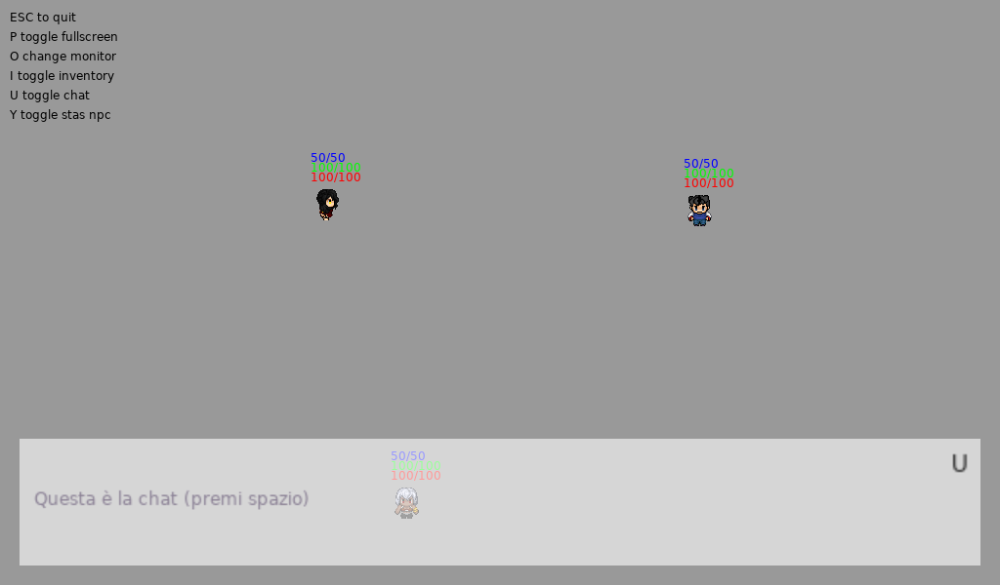
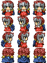

# Run
### Windows
 - Scarica la Repository completa ed esegui `run_win.bat`
### Linux (...)
 - `$ sudo apt-get install love`
 - `$ love src`

   
   
# Game
- ### main file `main.lua`
    Primo file che love utilizza.
    - Viene creato l'oggetto **boss**
    - Vengono definite le funzioni asincrone di **love2d**
        - `load()`
        - `update(dt)`
        - `draw()`
        - `keypressed(key)`
        - `keyreleased(key)`
        - `mousepressed(x, y, button)`
        - `mousereleased(x, y, button)`
        - `focus(f)`
        - `quit()`
        - in `keyreleased(key)` viene continuata la gestione del movimento del **player** sulla base dei tasti 'frecce' rilasciati
        - in `keypressed(key)` vengono definite e gestite dei tasti rapidi per l'utilizzo di alcune funzioni (questo punto verrà rimosso in futuro, ha solo scopo di comodita nella realizzazione del tutto)
            - `fullscreen`
            - `switch_monitor()`
            - `toggle_chat`
            - `toggle_inventory`
- ### Boss classe `boss.lua`
    Classe centrale del programma.
        - Ramo **interface**
            Su cui poi nasceranno le finestre **chat** e **inventory**
- ### settings file `settings.lua`
    - width, e height della finestra
    - dimensione **tile**
    - posizione e grandezza della chat
    - posizione e grandezza del inventario
- ### images folder `images/`
    - ### Spritesheet classe `images/spritesheet`
        Ritaglia i **quad** da dare agli sprite.
        Poi vengono utilizzati per "printare" il pezzo dell'immagine dello spritesheeet
        
- ### sprites folder `sprites/`
    - #### Group classe `sprites/group.lua`
        Grouppo di sprite (tipo pygame insomma)
    - #### Player classe estesa su Npc `sprites/player.lua`
        Sprite controllato dal giocatore
    - #### Npc classe estesa su Sprite `sprites/npc.lua`
        Sprite 'umanoidi'
    - #### Sprite classe `sprites/sprite.lua`
        Base per tutti gli sprite (sempre come pygame insomma)
- ### interface folder + __init\__
    - #### Chat classe estesa su Tab
        Finestra ora messa in basso (u)
    - #### Inventory classe estesa su Tab
        Finestra ora messa a destra (i)
    - #### Tab classe
        Base per tutte le tab (chat, intentory per ora)
