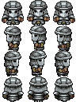
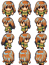
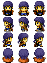
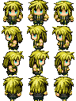
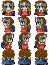

### La secchia rapita
Il poema narra la storia del conflitto tra **Bologna** e **Modena** al tempo dell'imperatore **Federico II**. Durante la battaglia di **Zappolino**, i bolognesi, dopo un'incursione nel territorio di **Modena**, furono respinti e inseguiti fino alla loro città; i modenesi, fermatisi presso un pozzo per dissetarsi, portarono via come trofeo di guerra una secchia di legno.

Al rifiuto dei modenesi di riconsegnare la secchia, i bolognesi dichiarano loro guerra. Ad essa partecipano, distribuiti tra le due parti, gli dei dell'Olimpo: **Apollo** e **Minerva** si schierano a fianco dei bolognesi; **Marte**, **Venere** e **Bacco** dei modenesi. Anche re Enzo, figlio dell'imperatore Federico II, parteggia per loro. Un elemento nuovo introdotto dal Tassoni è l'entrata in campo di un esercito di donne, guidato da **Renoppia**.

La guerra per la secchia rapita si protrae per qualche tempo fra battaglie, duelli, tregue e tornei, intercalati da episodi comici e burleschi che hanno spesso come protagonista il **conte di Culagna**. Innamoratosi di **Renoppia**, sfida a duello il prode **Melindo** e lo vince, secondo quanto predetto dalla profezia che aggiudica la vittoria al più debole e vile; e tenta di avvelenare la moglie, ma beve la pozione per errore ed è costretto a confessare la malefatta.

Alla fine il conflitto si conclude grazie a trattative condotte da un legato pontificio, che stabiliscono le seguenti condizioni:

**i bolognesi possono tenersi re Enzo, fatto prigioniero durante la battaglia di Fossalta; i modenesi, la secchia.**

<table>
    <tr>
        <td rowspan="3">Modena</td>
        <td>Marte</td>
        <td></td>
        <td> Dio della guerra </td>
    </tr>
    <tr>
        <td>Venere</td>
        <td></td>
        <td> Dea della bellezza </td>
    </tr>
    <tr>
        <td>Bacco</td>
        <td></td>
        <td> Dio del vino </td>
    </tr>
    <tr>
        <td rowspan="2">Bologna</td>
        <td>Apollo</td>
        <td></td>
        <td>Dio del sole</td>
    </tr>
    <tr>
        <td>Minerva</td>
        <td></td>
        <td>Dea della sapienza</td>
    </tr>
</table>

### El Cid
La spagna cristiana, composta da **Castiglia** e **Lèon**, fu suddivisa rispettivamente tra i due fratelli, **re Sancho** e **re Alfonso**. Regni in guerra fin da subito che vedono la partecipazione di **Rodrigo Diaz de Bivar**(El Cid) tra i capitani di **re Sancho**. **Re Alfonso** venne catturato dagli uomini di **El Cid**, durante la battaglia **Golpejera**.

I nobili di **Leòn**, progettarono e attuarono un agguato che causò la morte di **re Sancho**. **Alfonso** ormai libero tornò a **Leòn** e ritrovandosi la **Castiglia** senza eredi, allargò il suo dominio all'intera Spagna cristiana.

**El Cid** anche se non in ottimo rapporti con **Alfonso**, mantenne il giramento e continuò a servire il suo "nuovo" padrone.

### Montezuma

**Cuaohtemoc**, guerriero acquila di **Tenochtitlan**, interroga veggenti e stregoni, in seguito a delle apparizioni e dei segni intravvisti nella foresta. Le uniche risposte che ottenne anche allertando i monaci della capitale, furono: "gli dei reclamano più sacrifici" e "**Quetzalcoatl**, il serpente piumato, sta tornando dal suo esilio". **Montezuma** allarmato, concentrò i suoi guerrieri per mantenere controllati i tempi di **Quetzalcoatl**. **Xochimilco** e **Platinucco**, troppo vicini ai monasteri, e da sempre nemici degli aztechi, furono sconfitti e conquistati, e l'ottenimento di prigionieri aumento i sacrifici fattibili agli dei. Al ritorno nella capitale, **Cuaohtemoc** fu promosso a guerrieri giaguaro. Un ulteriore presagio, appare sotto gli occhi di **Montezuma**: il tempio del dio **Huitzlopochtli**, nella capitale, bruciò sotto alte fiamme, seppure fatto di pietra. Al tentativo dei cittadini di spegnere le fiamme con l'acqua, il fuoco si alzò ancora di più. Con un ulteriore conferma dai sacerdoti della capitale, **Montezuma** con l'appoggio della **triplice alleanza** (con altre due città stato azteche), dichiara guerra a **Tlaxcala**: nemico principale della **triplice alleanza**. Giaguari e Aquile contro Aironi (simbolo di Tlaxcala). Neanche cominciata la guerra che giunge **Cortes** e gli spagnoli dal mare, scambiati dagli aztechi per **Quetzalcoatl** ed altre divinità (Per le tecnologi sconosciute, i cavalli, le usanza, le armi, le armature...)

### Giovanna D'Arco
### Federico Barbarossa
### Wiliam Wallace
### Attila l'unno
